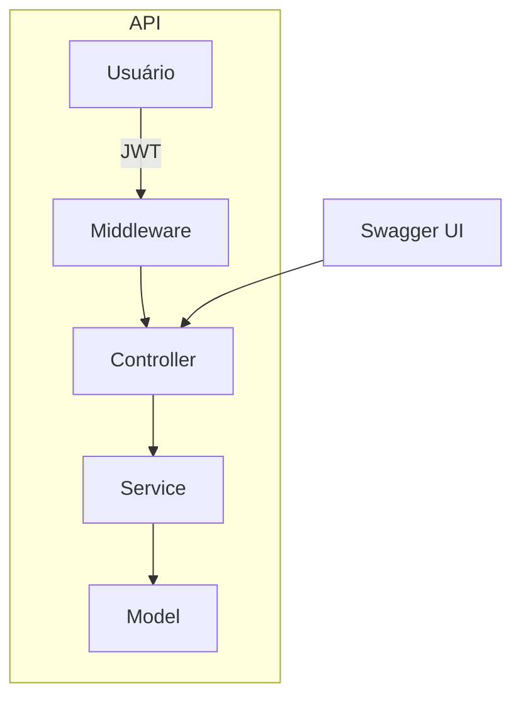

## Exemplos de requisições

### Login
```bash
curl -X POST http://localhost:3000/login \
   -H 'Content-Type: application/json' \
   -d '{"username": "admin", "password": "123456"}'
```

### Cadastro de paciente
```bash
curl -X POST http://localhost:3000/patients \
   -H 'Content-Type: application/json' \
   -H 'Authorization: Bearer <SEU_TOKEN_JWT>' \
   -d '{"cpf": "12345678900", "name": "Paciente Teste"}'
```

### Listar pacientes
```bash
curl -X GET http://localhost:3000/patients \
   -H 'Authorization: Bearer <SEU_TOKEN_JWT>'
```

### Agendar consulta
```bash
curl -X POST http://localhost:3000/appointments \
   -H 'Content-Type: application/json' \
   -H 'Authorization: Bearer <SEU_TOKEN_JWT>' \
   -d '{"cpf": "12345678900", "datetime": "2025-09-22T10:00:00Z"}'
```

### Listar consultas
```bash
curl -X GET http://localhost:3000/appointments \
   -H 'Authorization: Bearer <SEU_TOKEN_JWT>'
```
npm run test:external    # Testes externos (API real via HTTP)

# 🏥 API de Pacientes e Consultas

API RESTful desenvolvida em Node.js para gerenciar pacientes, usuários e agendamentos de consultas. Utiliza arquitetura **MVC** e autenticação JWT.

---

## 📦 Estrutura do Projeto

```
├── app.js                # Exporta o app Express
├── server.js             # Ponto de entrada do servidor
├── swagger.json          # Especificação Swagger
├── controller/           # Lógica HTTP (rotas)
├── service/              # Regras de negócio
├── model/                # Modelos de dados (em memória)
├── middleware/           # Autenticação JWT
├── test/                 # Testes unitários e externos
```

---

## 🛠️ Como executar

1. Instale as dependências:
    ```bash
    npm install
    ```
2. Inicie o servidor:
    ```bash
    npm start
    ```
    Acesse: [http://localhost:3000/api-docs](http://localhost:3000/api-docs) para documentação interativa.

---

## 🗺️ Arquitetura



- **Controller:** Recebe requisições HTTP, valida dados e delega para o service.
- **Service:** Implementa regras de negócio (ex: evitar duplicidade de CPF ou horário).
- **Model:** Armazena dados em memória.
- **Middleware:** Autentica via JWT.
- **Swagger UI:** Documentação interativa.

---

## 🚀 Endpoints principais

| Método | Rota             | Descrição                                 |
|--------|------------------|-------------------------------------------|
| POST   | /login           | Login de usuário (JWT)                    |
| POST   | /patients        | Cadastro de paciente                      |
| GET    | /patients        | Listagem de pacientes                     |
| POST   | /appointments    | Agendamento de consulta                   |
| GET    | /appointments    | Listagem de consultas                     |
| GET    | /api-docs        | Documentação Swagger                      |

---

## 📋 Exemplos de requisições

### Login
```bash
curl -X POST http://localhost:3000/login \
   -H 'Content-Type: application/json' \
   -d '{"username": "admin", "password": "123456"}'
```

### Cadastro de paciente
```bash
curl -X POST http://localhost:3000/patients \
   -H 'Content-Type: application/json' \
   -H 'Authorization: Bearer <SEU_TOKEN_JWT>' \
   -d '{"cpf": "12345678900", "name": "Paciente Teste"}'
```

### Listar pacientes
```bash
curl -X GET http://localhost:3000/patients \
   -H 'Authorization: Bearer <SEU_TOKEN_JWT>'
```

### Agendar consulta
```bash
curl -X POST http://localhost:3000/appointments \
   -H 'Content-Type: application/json' \
   -H 'Authorization: Bearer <SEU_TOKEN_JWT>' \
   -d '{"cpf": "12345678900", "datetime": "2025-09-22T10:00:00Z"}'
```

### Listar consultas
```bash
curl -X GET http://localhost:3000/appointments \
   -H 'Authorization: Bearer <SEU_TOKEN_JWT>'
```

---

## 🧪 Testes automatizados

```bash
npm run test:unit        # Testes unitários (controllers com mocks)
npm run test:external    # Testes externos (API real via HTTP)
```
Frameworks: Mocha, Chai, Sinon, Supertest.

---

## ⚠️ Observações
- O banco é resetado ao reiniciar o servidor.
- Atualize o `swagger.json` ao criar novos endpoints.
- O arquivo `app.js` exporta o app Express para facilitar testes.
# API de Pacientes e Consultas

Esta API Node.js permite:
- Login de usuários
- Registro e listagem de pacientes
- Agendamento e consulta de horários

O banco de dados é em memória (os dados são perdidos ao reiniciar o servidor).

## Como executar o projeto

1. Instale todas as dependências:
   ```bash
   npm install
   ```

2. Inicie o servidor:
   ```bash
   npm start
   ```
   O servidor ficará disponível em `http://localhost:3000`.

3. Acesse a documentação interativa Swagger em:
   - `http://localhost:3000/api-docs`

## Endpoints principais

- `POST /login` — Login (envie `username` e `password`)
- `POST /patients` — Cadastro de paciente (CPF e nome obrigatórios, não permite duplicados)
- `GET /patients` — Lista todos os pacientes
- `POST /appointments` — Agenda consulta (CPF e datetime obrigatórios, não permite horários duplicados)
- `GET /appointments` — Lista todas as consultas
- `GET /api-docs` — Documentação Swagger

## Testes automatizados

Para rodar todos os testes:
```bash
npm run test:unit        # Testes unitários (controllers com mocks)
npm run test:external    # Testes externos (API real via HTTP)
```
Os testes utilizam Mocha, Chai, Sinon e Supertest.

## Observações importantes
- O banco de dados é resetado ao reiniciar o servidor.
- O arquivo `app.js` exporta o app Express para facilitar testes automatizados.
- O projeto segue padrão MVC (controllers, services, models, middleware).
- Para novos endpoints, lembre-se de atualizar o arquivo `swagger.json`.
